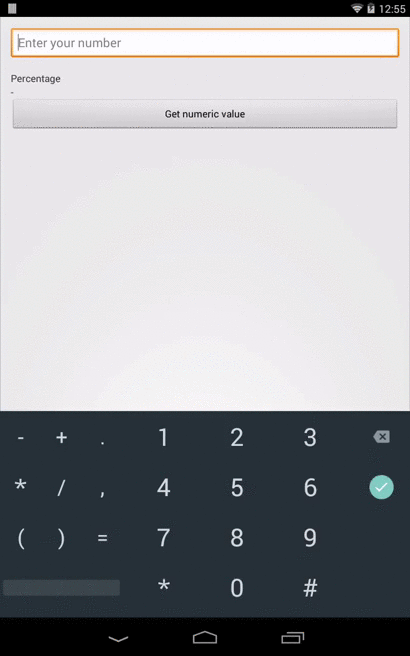

# numeric-edittext

[](https://travis-ci.org/hidroh/numeric-edittext)

A simple numeric EditText widget for Android that automatically formats input text using locale-specific decimal number format.

**Behaviour**

Input

    100000.75

Will be displayed as

    100,000.75

With numeric value of

    100000.75



**Usage**

Layout declaration:

```xml
<io.github.hidroh.numericedittext.NumericEditText
    android:inputType="numberDecimal|number"
    android:layout_width="match_parent"
    android:layout_height="wrap_content" />
```

Add and remove numeric value watcher the same way `TextWatcher` works for `EditText`:

```java
numericEditText.addNumericValueChangedListener(new NumericEditText.NumericValueWatcher() {
        @Override
        public void onChanged(double newValue) {
            // handle on numeric value changed
        }

        @Override
        public void onCleared() {
            // handle value cleared
        }
    });
```

Get numeric value behind input value in `EditText`:

```java
numericEditText.getNumericValue();
```

**Download**

Gradle:

```groovy
repositories {
    maven { url "https://jitpack.io" }
}

dependencies {
    compile 'com.github.hidroh:numeric-edittext:0.1.0'
}
```

**License**

    Copyright 2015 Ha Duy Trung

    Licensed under the Apache License, Version 2.0 (the "License");
    you may not use this file except in compliance with the License.
    You may obtain a copy of the License at

        http://www.apache.org/licenses/LICENSE-2.0

    Unless required by applicable law or agreed to in writing, software
    distributed under the License is distributed on an "AS IS" BASIS,
    WITHOUT WARRANTIES OR CONDITIONS OF ANY KIND, either express or implied.
    See the License for the specific language governing permissions and
    limitations under the License.